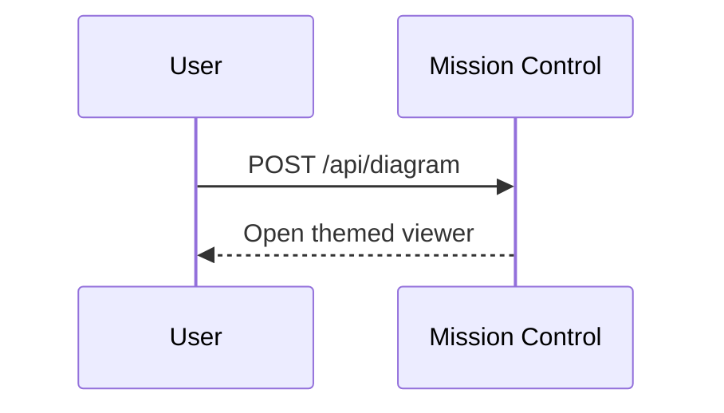

Mission Control agent sessions receive env vars automatically:

- `MC_API_URL` — loopback API base (e.g. `http://127.0.0.1:54321`)
- `MC_API_TOKEN` — bearer token for that API
- `MC_TASK_ID` — the active task/session id
- `MC_THEME` — Mission Control UI theme: `dark` or `light`

**Do not print Mermaid to the user and stop.** POST it to Mission Control so the app opens an interactive viewer modal. The viewer applies Mission Control theme colors automatically — your job is to avoid fighting that styling with near-black/near-white fills, while still coloring nodes for clarity.

## When to use

- User asks for a diagram, flowchart, sequence diagram, architecture map, or state chart
- You are explaining a multi-step system and a diagram would land faster than prose
- You already drafted Mermaid and would otherwise paste it in the terminal

Skip when Mission Control env vars are missing (plain shell outside MC) — fall back to inline Mermaid in markdown.

## API contract

```http
POST $MC_API_URL/api/diagram?taskId=$MC_TASK_ID
Authorization: Bearer $MC_API_TOKEN
Content-Type: application/json

{
  "source": "<mermaid source>",
  "title": "Optional title shown in the modal",
  "format": "mermaid",
  "theme": "dark"
}
```

`theme` is optional metadata — pass `"$MC_THEME"` when set so Mission Control knows which UI theme was active. The viewer still re-renders using the live app theme.

Success (`200`): `{ "ok": true, "id": "<uuid>" }` — Mission Control opens the viewer automatically.

Common errors:

- `400` — missing/invalid body, empty `source`, or `taskId` query param missing
- `401` — bad or missing bearer token
- `404` — unknown `taskId`

## Layout rules (critical)

1. **Keep 1 layer by default.** Prefer a flat diagram — no `subgraph` blocks, nested groups, or multi-tier partitions — unless multiple layers are necessary to explain real boundaries (e.g. client vs server vs database, or swimlanes the user asked for).
2. **Add layers only when needed.** Use subgraphs sparingly and only one nesting level deep. If a multi-layer diagram is getting dense, split into multiple focused POSTs with distinct titles instead of nesting deeper.
3. **Prefer flat flow.** `A --> B --> C` beats `subgraph Outer` / `subgraph Inner` unless the grouping carries meaning the edges alone cannot.

## Theme & color rules (critical)

Mission Control runs in dark mode by default. Diagrams fail when agents embed colors that disappear on dark backgrounds (dark gray boxes, faint borders, `#111` fills).

1. **Do not override Mermaid theme in `source`.** Never use `%%{init: {'theme':'dark'}}%%`, `%%{init: {'theme':'base', 'themeVariables': ...}}%%`, or YAML frontmatter theme blocks — those fight Mission Control's viewer.
2. **Do color the nodes.** Use `classDef` / `:::className` (or per-node `style`) so roles are visually distinct — e.g. actors, services, stores, decisions. Mid-saturation fills with readable text; not near-black or near-white.
3. **Read `$MC_THEME`.** When it is `dark`, avoid near-black node/participant fills and low-contrast borders. When it is `light`, avoid near-white fills on white backgrounds.
4. **Sequence diagrams:** color participants when it helps distinguish roles, but keep contrast with the theme. Example of plain sequence when color isn't needed:



5. **Flowcharts:** color nodes by role. Prefer a small palette of `classDef`s over one-off hex on every node.

Safe example palette (works on dark; still readable on light):


## Rules

1. **Always send valid Mermaid** in `source`. No markdown fences — raw diagram text only.
2. **Keep diagrams focused.** Prefer one concern per diagram; split large maps into multiple POSTs with distinct titles.
3. **Keep 1 layer unless multi-layer is necessary** (see Layout rules).
4. **Color nodes** by role with theme-safe fills (see Theme & color rules).
5. **Set a short `title`** when the diagram has a clear name (e.g. "Auth flow", "Worktree lifecycle").
6. **Pass `"theme": "$MC_THEME"`** in the JSON body when `$MC_THEME` is set.
7. **Tell the user briefly** that the diagram opened in Mission Control — don't repeat the full source unless they ask.
8. **On HTTP failure**, show the error and paste the Mermaid source as a fallback.
9. **Verify env vars before POSTing.** If `MC_API_URL`, `MC_API_TOKEN`, or `MC_TASK_ID` is empty, tell the user the session is not running inside Mission Control.

## Examples

### Minimal POST (preferred — no jq required)

```bash
curl -sS -X POST "$MC_API_URL/api/diagram?taskId=$MC_TASK_ID" \
  -H "Authorization: Bearer $MC_API_TOKEN" \
  -H "Content-Type: application/json" \
  -d @- <<EOF
{
  "source": "flowchart LR\n  A[Draft Mermaid] --> B[POST /api/diagram]\n  B --> C[Modal opens]\n  classDef input fill:#3b82f6,stroke:#93c5fd,color:#fff\n  classDef action fill:#8b5cf6,stroke:#c4b5fd,color:#fff\n  classDef result fill:#10b981,stroke:#6ee7b7,color:#fff\n  class A input\n  class B action\n  class C result",
  "title": "Diagram pipeline",
  "format": "mermaid",
  "theme": "${MC_THEME:-dark}"
}
EOF
```

### Sequence diagram

```bash
curl -sS -X POST "$MC_API_URL/api/diagram?taskId=$MC_TASK_ID" \
  -H "Authorization: Bearer $MC_API_TOKEN" \
  -H "Content-Type: application/json" \
  -d "$(jq -n \
    --arg source 'sequenceDiagram
  participant U as User
  participant MC as Mission Control
  participant A as Agent CLI
  U->>MC: Start session
  MC->>A: Spawn PTY + env
  A->>MC: POST /api/diagram
  MC-->>U: Open diagram modal' \
    --arg title 'Session diagram flow' \
    --arg theme "${MC_THEME:-dark}" \
    '{source:$source,title:$title,format:"mermaid",theme:$theme}')"
```

### Flowchart (flat, colored nodes)

```bash
curl -sS -X POST "$MC_API_URL/api/diagram?taskId=$MC_TASK_ID" \
  -H "Authorization: Bearer $MC_API_TOKEN" \
  -H "Content-Type: application/json" \
  -d "$(jq -n \
    --arg source 'flowchart LR
  A[Draft Mermaid] --> B[POST /api/diagram]
  B --> C[Modal opens]
  classDef input fill:#3b82f6,stroke:#93c5fd,color:#fff
  classDef action fill:#8b5cf6,stroke:#c4b5fd,color:#fff
  classDef result fill:#10b981,stroke:#6ee7b7,color:#fff
  class A input
  class B action
  class C result' \
    --arg title 'Diagram pipeline' \
    --arg theme "${MC_THEME:-dark}" \
    '{source:$source,title:$title,format:"mermaid",theme:$theme}')"
```

## Mermaid tips

- Prefer `flowchart TD/LR`, `sequenceDiagram`, `stateDiagram-v2`, and `erDiagram` — they render reliably.
- Quote node labels with special characters: `A["Step (retry)"]`
- Avoid `click` directives and HTML labels — the viewer runs in strict mode.
- Default to one flat layer; add subgraphs only when boundaries matter.
- Color nodes by role with mid-saturation fills; never near-black (`#111`) or near-white (`#eee`) fills that vanish against the theme.
